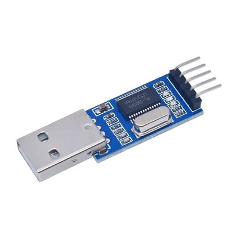
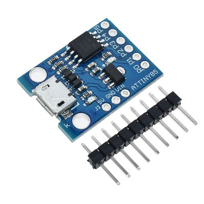
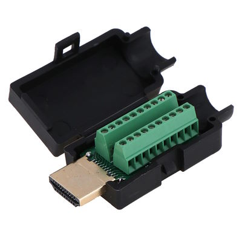
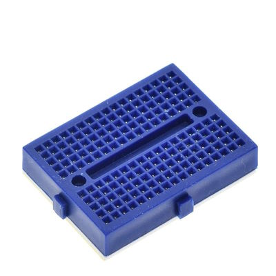
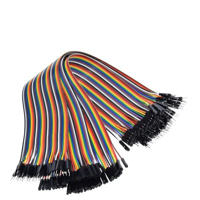

# cec\_lg\_off LOM for DIY device from modules.

### List of materials (LOM) for device

Same as BOM, but with instructions and no prices.

* **PL2303** USB-TTL (USB-SERIAL) adapter.
	* ⚠️ **WARNING**: PL2303HX, PL2303TA are recommended. Non-PL* alternatives are not allowed.
	* Before buying next, ensure your adapter has VID 067B and PID 2303
	* Before buying next, ensure your TV recognizes PL2303 adapter
		* Turn TV on
		* Plug PL2303 adapter into TV USB port
		* Ensure message apperared without words like "unknown" or "unrecognized"
	* Links: [🔗 AliExpress](https://aliexpress.com/item/32531899568.html)
	* Image: 
* **DigiSpark USB** developement board
	* Prefer board with female USB connector.
	* Links: [🔗 AliExpress](https://aliexpress.com/item/32584084654.html), [🔗 AliExpress](https://aliexpress.com/item/32807895683.html)
	* Image: 
* **HDMI A male connector with screw terminals**
	* Links: [🔗 AliExpress](https://aliexpress.com/item/1005001515985184.html)
	* Image: 
* **Solderless mini breadboard**
	* Links: [🔗 AliExpress](https://aliexpress.com/item/32649320530.html)
	* Image: 
* **DuPont cables**
	* You'll need 2 long cables `male-male` and 5 `male-female`
	* Links: [🔗 AliExpress](https://aliexpress.com/item/32825558073.html)
	* Image: 
* Some good insulating tape
* Soldering iron
	