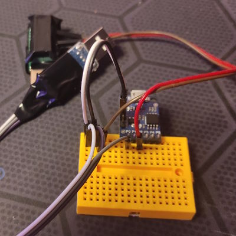
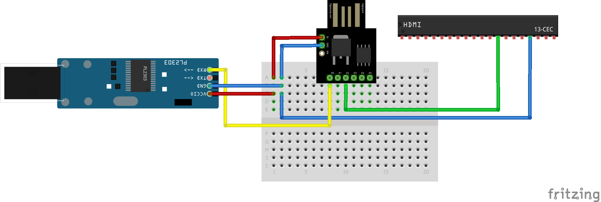
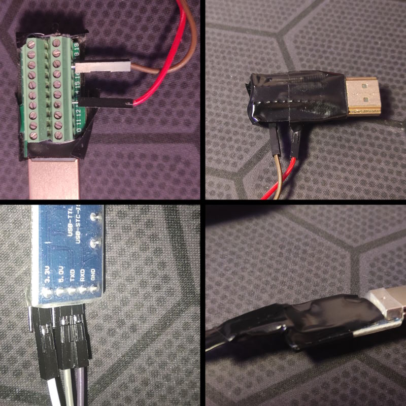

### Bill of materials (BOM) / List of materials (LOM)

Materials for building device from modules are listed in separate [List of materials (LOM) document](LOM_MODULES.md).

### Device photos

*brown wire connected wrong hole on this photo. Is should be connected to 2nd column (black wires)*

### Making of device

* Ensure your TV is LG and it supports SimpLink (HDMI CEC).
* Ensure device connected supports HDMI CEC: device must react to commands from TV Remote.
* Ensure your TV runs WebOS
* Ensure you have free USB port on your TV
* Ensure you have free HDMI port on your TV
* Buy PL2303 USB Adapter
* Insert PL2303 USB Adapter into USB port of your TV and ensure it is recognized by TV (message about USB device should appear, without *unrecognized* word)
* Order rest of modules.
* Solder pins to DigiSpark
* Assemble by scheme
	*   
* Flash firmware
* Isolate unisolated parts, tape mechanically bad contacts
	* 
* Isolate DigiSpark USB connector with tape to avoid using it while connected to TV.
* Connect to TV: USB to USB, HDMI to HDMI
* Test: make any device send STANDBY command to TV. When command received by `cec_lg_off`, it will shortly flash with onboard red led.